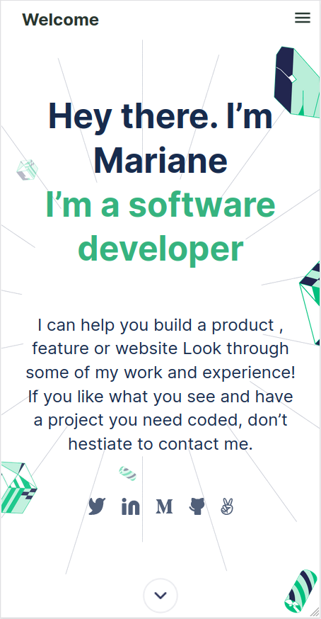

# FIRST PORTFOLIO

> My second Microverse Project - "Portfolio: setup and mobile version skeleton"

> The first screen of a long project.

## Built With

- HTML
- CSS

## Live Demo

[Live Demo Link]()

https://yothu.github.io/my-portfolio/

## Author

👤 David Vergaray

- GitHub:   [@Yothu](https://github.com/Yothu)
- Twiter:   [@Daivhy](https://twitter.com/Daivhy)
- LinkedIn: [David V.](https://www.linkedin.com/in/david-vergaray-almontes-051a11127/)

## 🤝 Contributing

Contributions, issues, and feature requests are welcome!

Feel free to check the [Issues page](./issues/).

## Show your support

Give a ⭐️ if you like this project!

## License

This project is [MIT](./MIT.md) licensed.
